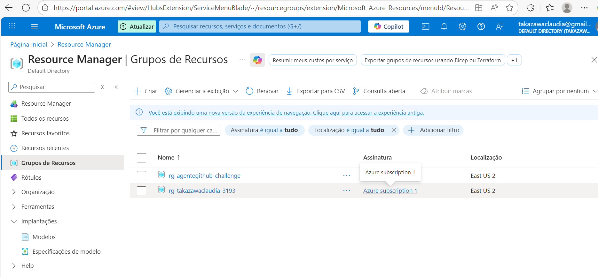
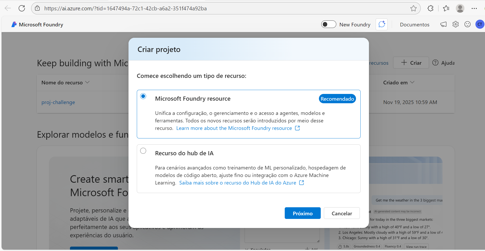
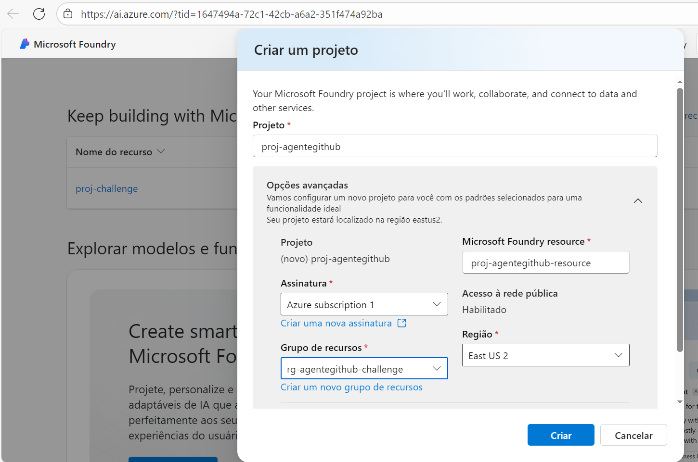
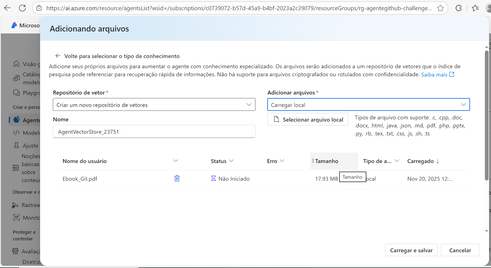
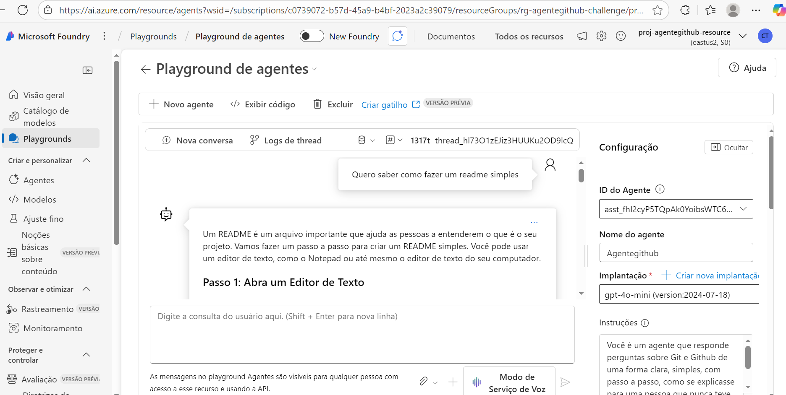
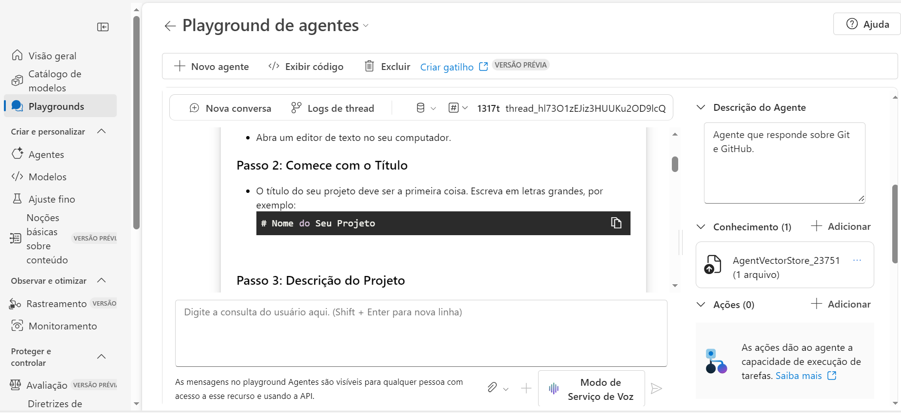

# AzureFrontierGirls-Agent-Challenge
Agente que responde perguntas sobre o Git e GitHub

## Objetivo
Facilitar o estudo sobre o funcionamento do Git e GitHub.

## Descrição
Este agente foi criado no Foundry da Microsoft com o nome de AgenteGithub e usando o modelo gpt-4o-mini de implantação.
Para tanto, um grupo de recursos (nomeado de rg-agentegithub-challenge) e um projeto (nomeado de proj-agentegithub) foram criados.

## A instrução dada ao agente foi: "Você é um agente que responde perguntas sobre Git e Github de uma forma clara, simples, com passo a passo, como se explicasse para uma pessoa que nunca teve contato com informática. Seja gentil e paciente. Não responda sobre outros assuntos."

## Um Ebook sobre o Git foi colocado no conhecimento do agente.

## Realizando testes no Playground, o agente deu a resposta esperada.

